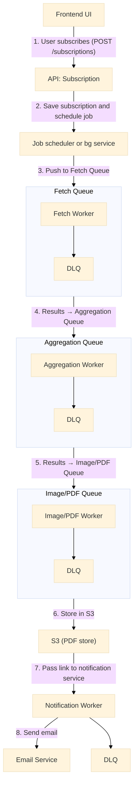

# Automated Reporting Feature
## Overview

We are extending our product with an automated reporting feature. Users participating in clinical trials need to receive weekly PDF summaries that aggregate database records and related files (text, images). These reports are generated via a long-running background process and delivered via email.

The system is designed for a large user base and heavy usage, with reliability, scalability, and fault tolerance as primary goals.

## User Stories

 1. As a user, I want to subscribe to a weekly report.

 2. As a user, I want to receive the report via email.

## Assumptions

 - File data is stored in AWS S3, metadata in NoSQL (MongoDB).

 - Reports require complex data aggregation and image/PDF processing.

 - The system must handle tens of thousands of concurrent report jobs.

 - Failures must not block processing → handled via retries + DLQs.

## Architecture

Our automated reporting system follows a **microservices architecture** built around **event-driven** processing and **message queues**. The design prioritizes horizontal scalability, fault tolerance, and loose coupling between components to handle the demanding requirements of clinical trial reporting at scale.
The architecture separates concerns into distinct layers: a **user-facing API layer** for subscription management, a **job orchestration layer** for scheduling and coordination, **specialized worker services** for data processing, and **shared infrastructure** services for storage and notifications. This separation allows each component to scale independently based on workload demands.

You can visualize the system with a mind map.


### High-Level Architecture



The system processes reports through a **multi-stage pipeline** where each stage can operate at different speeds and scales. Queue depths provide natural backpressure, and workers can be scaled up or down based on processing demands. This design ensures that even if one component experiences issues, the entire pipeline remains operational. 


## Extended API

In addition to the existing **Documents API**, the system provides a **Subscriptions API** for managing report subscriptions and **Jobs API** for job status updates.

### Subscriptions API Endpoints

| Method | Endpoint                        | Description                                 |
|--------|---------------------------------|---------------------------------------------|
| POST   | `/api/subscriptions`            | Create a new subscription                   |
| GET    | `/api/subscriptions/{id}`       | Retrieve subscription details               |
| PATCH  | `/api/subscriptions/{id}`       | Update subscription preferences             |
| DELETE | `/api/subscriptions/{id}`       | Unsubscribe a user and remove scheduled jobs|

---

#### POST /api/subscriptions
Create a new subscription.  

**Request**
```json
{
  "userId": "123456",
  "reportType": "weekly",
  "filters": {
    "dateRange": "last_week",
    "fileTypes": ["pdf", "jpg"]
  }
}
```
**Response**
```json
{
  "subscriptionId": "abc123",
  "status": "active"
}
```

### Jobs API Endpoints

| Method | Endpoint                        | Description                                 |
|--------|---------------------------------|---------------------------------------------|
| GET    | `/api/jobs/{id}`                | Get current job status    |
| Get    | `/api/subscriptions/{id}/jobs`  | List recent jobs for subscription           |

---
#### Job Status Response:
```json
{
  "jobId": "job_789",
  "subscriptionId": "abc123", 
  "status": "completed", // pending, processing, completed, failed
  "createdAt": "2025-01-15T10:00:00Z",
  "completedAt": "2025-01-15T10:30:00Z",
  "reportUrl": "https://s3.amazonaws.com/...", // only when completed
  "error": null
}
```
## Flow Description

**1. Subscription**

  - User clicks "Subscribe" button in frontend.
  - API verifies user **permissions/rights**.
  - If allowed, **subscription record** is saved in a database.
  - A scheduled job is created with necessary metadata (user ID, report type, schedule info, etc...)

**2. Job Scheduling**

  - A background service periodically scans for scheduled jobs whose `createdAt` or `nextRun` timestamp is due.
  - For each eligible job, it pushes a message into a job queue (e.g., SQS, RabbitMQ) describing the work to be done (documents to aggregate, processing details).

**3. Workers & Queues**
  - Every worker is subscribed to the queue.
  - **Fetch Worker**: retrieves documents & files → pushes results to Aggregation Queue.
  - **Aggregation Worker**: aggregates tabular + file data → pushes results to Processing Queue.
  - **Image/PDF Worker**: generates PDF reports, stores them in S3 → pushes results to Notification Queue.
  - **Notification Worker**: generates a secure S3 link → calls Email Service → delivers report.

**4. Failure Handling**

  - Each queue is backed by a Dead Letter Queue (DLQ).
  - Workers retry jobs automatically.
  - Persistent failures go to DLQ for investigation without blocking the pipeline.

**5. File – Metadata Consistency**

  - Files are uploaded to S3 first.
  - Metadata in NoSQL updated only after a successful upload.
  - Background reconciliation jobs compare S3 vs DB for consistency.

## Scalability & Performance

| Technique     | Application Area                       |
|---------------|----------------------------------------|
| Batching      | Fetch multiple documents/files per job |
| Parallelism   | Run multiple workers concurrently.     |
| Autoscaling   | Scale workers based on queue depth.    |
| Caching       | Cache shared data across reports.      |
| Rate Limiting | Email delivery and S3 access           |


## Best Practices Applied

 - **Scalability**: Independent workers, horizontal scaling based on queue depth.
 - **Reliability**: DLQs, retries, idempotent job execution.
 - **Performance**: Queues buffer workload, workers' process asynchronously.
 - **Security**: Reports delivered via pre-signed S3 links + encrypted at rest and in transit.
 - **Observability**: Monitor queue depth, worker health, failure rates.

## Next Steps for Implementation

 - Define queue structure (separate SQS queues for fetch, aggregation, processing, notification).
 - Implement workers as stateless services (e.g., AWS Lambda, ECS, or Kubernetes Jobs).
 - Extend API with `api/subscriptions` and `api/jobs`.
 - Integrate email service (SendGrid).
 - Set up monitoring/alerting (CloudWatch, Prometheus, or ELK).
 - Define deployment and rollback procedures.
 - Load test pipeline under peak concurrency.
 - Set up S3 retention and cleanup policies.
 - Define retry policies and DLQ handling.
